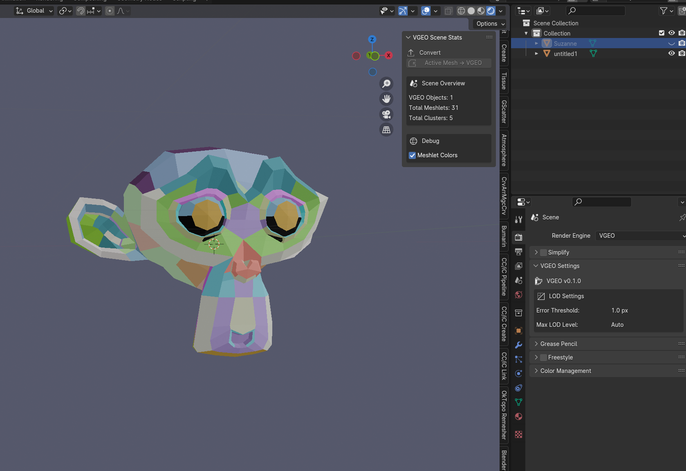

<p align="center">
  
</p>

<h1 align="center">VGEO — Virtualized Geometry for Blender</h1>

<p align="center">
  Nanite-style meshlet rendering in the Blender viewport, built on Vulkan.
</p>

---

## What it does

VGEO converts meshes into a compact meshlet format and renders them live inside Blender's viewport using a headless Vulkan renderer. The current proof-of-concept renders full meshlet color debug visualization — each cluster gets a unique color, matching the kind of view Unreal's Nanite debug mode shows.

<p align="center">
  
</p>

*Meshlet color debug view with the VGEO N-panel. Blender render engine set to VGEO.*

---

## Current state

- Convert any Blender mesh to `.vgeo` with one button
- Live viewport rendering via headless Vulkan → pixel readback → Blender GPU texture
- Meshlet color debug mode (toggle in the N-panel)
- Camera orbit, pan, and zoom tracked from Blender's viewport
- Proxy object transform tracked — move/rotate the proxy and the render follows
- Scene stats panel showing meshlet and cluster counts

---

## How to use

### Build

```
mkdir build && cd build
cmake ..
cmake --build . --config Release
```

Requires Vulkan SDK, CMake 3.20+, and a C++20 compiler. Builds `vgeo_build.exe` and `vgeo_native.pyd` (Python extension for Blender).

### Install the addon

1. In Blender: **Preferences → File Paths → Scripts** — point it to the repo root (`NewRepo/`)
2. **Preferences → Add-ons** — search for "VGEO" and enable it
3. Copy `build/src/python/Release/vgeo_native.pyd` next to the addon's `__init__.py`

### Convert and view

1. Select a mesh in Blender
2. Open the **N-panel → VGEO → Convert Active Mesh → VGEO**
3. Save the `.vgeo` file anywhere
4. Switch the render engine to **VGEO** (Properties → Render → Render Engine)
5. Toggle **Meshlet Colors** in the N-panel to see cluster visualization

---

## Architecture

```
Blender mesh
    │
    ▼
vgeo_build.exe        ← meshlet generation via meshoptimizer
    │
    ▼
.vgeo file            ← compact binary: meshlets + cluster BVH + indices
    │
    ▼
vgeo_native.pyd       ← pybind11 C++ extension loaded by Blender
    │
    ▼
VGEORenderEngine      ← Blender RenderEngine subclass
    │
    ├── vgeo_native.Scene    — scene graph, object transforms
    ├── vgeo_native.Camera   — synced from Blender viewport each frame
    └── vgeo_native.Renderer — headless Vulkan renderer
            │
            └── pixel readback → gpu.texture → draw_texture_2d
```

---

## Project structure

```
addons/vgeo_blender/     Blender addon (engine, operators, panels)
src/
  core/                  Camera, scene graph, math utilities
  preprocess/            Mesh → .vgeo converter (meshlet builder)
  runtime/               Headless Vulkan offscreen renderer
  python/                pybind11 bindings
tools/vgeo_build/        CLI converter tool
src/runtime/shaders/     GLSL shaders (compiled to SPIR-V at build time)
spec/                    Format specifications
```

---

## Requirements

- GPU with Vulkan 1.3+
- Windows 10+ (Linux/macOS via MoltenVK untested)
- Blender 4.0+
- CMake 3.20+, C++20 compiler, Vulkan SDK

---

## Acknowledgments

Built on insights from Epic Games' Nanite, [meshoptimizer](https://github.com/zeux/meshoptimizer) by Arseny Kapoulkine, and NVIDIA mesh shader research.
