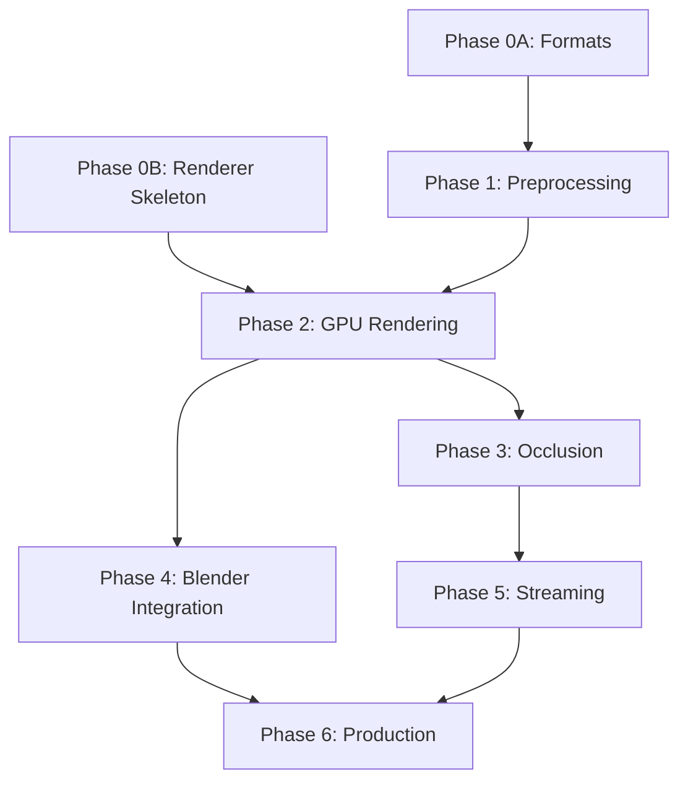

# VGEO Project Specification v1.0

## Overview

VGEO (Virtualized Geometry) is a Nanite-class geometry virtualization system for Blender, enabling real-time rendering of billions of triangles through intelligent clustering, GPU-driven culling, and on-demand streaming.

## Analysis of Previous Approach

### Issues Identified

1. **Deferred Decisions** - Integration path (external vs native) was deferred, but it fundamentally affects architecture
2. **Monolithic Phases** - Large phases without incremental validation
3. **Missing Parallelism** - Many workstreams could run concurrently
4. **Underspecified Formats** - File formats were stub definitions
5. **No Testing Strategy** - Validation was an afterthought
6. **Unclear Dependencies** - What blocks what wasn't defined

### Key Insights from Research

| Topic | Finding | Implication |
|-------|---------|-------------|
| Meshlets | ~64 verts / ~126 tris optimal (NVIDIA) | Use meshoptimizer, don't reinvent |
| Blender Vulkan | Not stable until 5.0 (2025+) | Must use OpenGL or external renderer |
| Integration | Native plugin = best UX, hardest | Hybrid approach: external renderer, embedable later |
| Streaming | Complex, can defer | Start with in-memory, add streaming later |
| GPU Culling | Critical for performance | Prioritize early |

## Revised Architecture

### Core Principle: Hybrid Rendering Pipeline

Two rendering paths from the same virtualized geometry:

```
                         ┌─────────────────────────────────────┐
                         │        Blender Addon (Python)       │
                         │   Export, Sync, UI, Mode Toggle     │
                         └──────────────┬──────────────────────┘
                                        │
                    ┌───────────────────┴───────────────────┐
                    ▼                                       ▼
    ┌───────────────────────────────┐     ┌───────────────────────────────┐
    │   VIEWPORT PATH (Real-time)   │     │   FINAL RENDER PATH (Cycles)  │
    │                               │     │                               │
    │  VGEO Runtime (Vulkan)        │     │  LOD Mesh Generator           │
    │  - GPU cluster culling        │     │  - Camera-based LOD selection │
    │  - Screen-space LOD           │     │  - Bake visible clusters      │
    │  - PBR shading + shadows      │     │  - Export optimized mesh      │
    │  - 60fps with billions tris   │     │  - Feed to Cycles             │
    │                               │     │  - Faster BVH, less memory    │
    └───────────────────────────────┘     └───────────────────────────────┘
                    │                                       │
                    ▼                                       ▼
           Fast Interactive Preview              High-Quality Final Render
           (Eevee+ quality, massive geo)         (Cycles quality, practical scenes)
```

### Detailed Component Stack

```
┌─────────────────────────────────────────────────────────────┐
│                    Blender Addon (Python)                   │
│         Export │ Viewport Sync │ Cycles Bridge │ UI         │
├─────────────────────────────────────────────────────────────┤
│                    Integration Layer                        │
│         Socket/SharedMem ──or── Native C Extension          │
├──────────────────────────────┬──────────────────────────────┤
│   VGEO Runtime (C++/Vulkan)  │    Cycles LOD Bridge (C++)   │
│   Culling │ LOD │ Rendering  │    LOD Select │ Mesh Bake    │
├──────────────────────────────┴──────────────────────────────┤
│                   VGEO Preprocessing (C++)                  │
│        Mesh Import │ Meshlet Gen │ Hierarchy │ Export       │
├─────────────────────────────────────────────────────────────┤
│                      File Formats                           │
│              .vgeo (clusters) │ .vscene (manifest)          │
└─────────────────────────────────────────────────────────────┘
```

### Why Hybrid?

| Scenario | Path | Result |
|----------|------|--------|
| Artist orbiting 500M tri sculpt | Viewport | 60fps, instant feedback |
| Final beauty render | Cycles | Path-traced quality, but scene actually loads |
| Animation preview | Viewport | Real-time playback |
| Final animation frames | Cycles + LOD | Tractable render times |

### Design Decisions (Locked)

| Decision | Choice | Rationale |
|----------|--------|-----------|
| GPU API | Vulkan | Cross-platform, modern, mesh shaders |
| Language | C++ (core), Python (addon) | Performance + Blender compat |
| Build System | CMake | Industry standard |
| Meshlet Library | meshoptimizer | Battle-tested, MIT license |
| Initial Integration | External Viewer | Faster iteration, proves renderer works |
| Future Integration | Native Plugin | Best UX, reuse renderer as library |

## Revised Phase Structure

### Phase 0: Foundation (2 parallel tracks)

**Track A: File Formats & Tools**
- [ ] Define `.vgeo` binary format specification
- [ ] Define `.vscene` manifest format (JSON)
- [ ] Build CLI validator tool
- [ ] Create test meshes (cube, sphere, stanford bunny)

**Track B: Renderer Skeleton**
- [ ] Vulkan initialization + window
- [ ] Camera controls (orbit, pan, zoom)
- [ ] Basic triangle rendering (hardcoded)
- [ ] ImGui debug overlay

**Exit Criteria:** Can render hardcoded triangles, formats are specified

---

### Phase 1: Preprocessing Pipeline

**1.1 Mesh Import**
- [ ] Load OBJ/glTF meshes
- [ ] Extract positions, normals, UVs, indices
- [ ] Apply transforms, triangulate

**1.2 Meshlet Generation**
- [ ] Integrate meshoptimizer
- [ ] Generate meshlets (64v/126t target)
- [ ] Compute bounding spheres per meshlet
- [ ] Compute normal cones per meshlet

**1.3 Cluster Hierarchy**
- [ ] Group meshlets into clusters
- [ ] Build parent clusters via simplification
- [ ] Compute error metrics per level
- [ ] Generate DAG structure

**1.4 Export**
- [ ] Write `.vgeo` files
- [ ] Write `.vscene` manifest
- [ ] Compression (LZ4 or zstd)

**Exit Criteria:** Can convert OBJ → .vgeo, validator passes

---

### Phase 2: GPU-Driven Rendering

**2.1 Data Upload**
- [ ] Load .vgeo into GPU buffers
- [ ] Vertex buffer, index buffer, meshlet table
- [ ] Cluster hierarchy buffer

**2.2 Cluster Culling (Compute)**
- [ ] Frustum culling per cluster
- [ ] Backface culling (normal cone test)
- [ ] Output visible cluster list

**2.3 LOD Selection**
- [ ] Screen-space error computation
- [ ] DAG traversal for optimal cut
- [ ] Select clusters meeting error threshold

**2.4 Indirect Drawing**
- [ ] Generate draw commands from visible list
- [ ] Multi-draw indirect rendering
- [ ] Debug visualization (cluster colors, bounds)

**Exit Criteria:** Stanford Dragon (1M tris) renders at 60fps with culling visible in debug

---

### Phase 3: Occlusion & Optimization

**3.1 HZB Generation**
- [ ] Depth prepass or previous frame depth
- [ ] Mipmap pyramid (max reduction)
- [ ] GPU compute generation

**3.2 Occlusion Culling**
- [ ] Two-pass culling (prev frame HZB + refresh)
- [ ] Conservative depth test per cluster
- [ ] Integrate with frustum culling

**3.3 Software Rasterization (Optional)**
- [ ] Detect micro-triangle clusters
- [ ] Compute shader rasterization path
- [ ] Visibility buffer output

**Exit Criteria:** 100M triangle scene at 30+ fps, occlusion demonstrably working

---

### Phase 4: Blender Integration (Viewport)

**4.1 Addon Foundation**
- [ ] Blender addon skeleton (Python)
- [ ] Export selected objects to .vgeo
- [ ] Launch external viewer process

**4.2 Camera Sync**
- [ ] Socket/pipe communication
- [ ] Live viewport camera → viewer camera
- [ ] Handle viewport resize

**4.3 UX Polish**
- [ ] "Preview VGeo" toggle button
- [ ] Quality slider (error threshold)
- [ ] Stats panel (clusters visible, VRAM)

**Exit Criteria:** User can export mesh, click preview, orbit in synced viewer

---

### Phase 4B: Cycles Integration (Final Render)

**4B.1 LOD Mesh Extraction**
- [ ] Select appropriate LOD clusters for camera
- [ ] Merge visible clusters into single mesh
- [ ] Preserve UVs and material assignments

**4B.2 Cycles Bridge**
- [ ] Create temporary Blender mesh from LOD data
- [ ] Replace original high-poly with LOD proxy
- [ ] Trigger Cycles render
- [ ] Restore original after render

**4B.3 Smart LOD Selection**
- [ ] Distance-based LOD (further = coarser)
- [ ] Screen coverage estimation
- [ ] Memory budget awareness
- [ ] Optional: per-object LOD override

**Exit Criteria:** 1B triangle scene renders in Cycles using ~10M triangle LOD proxy

---

### Phase 5: Streaming & Scale

**5.1 Page System**
- [ ] Divide clusters into fixed-size pages (~128KB)
- [ ] Page table data structure
- [ ] Root pages always resident

**5.2 Async Loading**
- [ ] Background IO thread
- [ ] Priority queue (screen-space importance)
- [ ] Staging buffer upload

**5.3 Eviction**
- [ ] LRU tracking per page
- [ ] Memory budget enforcement
- [ ] Graceful LOD fallback when starved

**Exit Criteria:** 1B triangle scene streams from disk at 30fps

---

### Phase 6: Production Hardening

- [ ] Materials (visibility buffer + deferred)
- [ ] Instancing support
- [ ] Multi-object scenes
- [ ] Robust error handling
- [ ] Cross-GPU testing

## File Format Specifications

### .vgeo Format v0

```
┌──────────────────────────────────────┐
│ Header (64 bytes)                    │
│   magic: "VGEO" (4 bytes)            │
│   version: major.minor (4 bytes)     │
│   flags: (4 bytes)                   │
│   meshletCount: u32                  │
│   clusterCount: u32                  │
│   vertexCount: u32                   │
│   indexCount: u32                    │
│   bounds: AABB (24 bytes)            │
│   reserved (16 bytes)                │
├──────────────────────────────────────┤
│ Chunk Directory                      │
│   chunkCount: u32                    │
│   entries[]: { type, offset, size }  │
├──────────────────────────────────────┤
│ Chunks (variable)                    │
│   VERT: vertex positions (f32x3)     │
│   NORM: normals (snorm16x2 oct)      │
│   UVCО: UVs (f16x2)                  │
│   INDX: indices (u32 or u16)         │
│   MSLT: meshlet descriptors          │
│   CLST: cluster hierarchy            │
│   BVOL: bounding volumes             │
│   CONE: normal cones                 │
└──────────────────────────────────────┘
```

### .vscene Format v0

```json
{
  "version": "0.1.0",
  "generator": "vgeo-build",
  "assets": [
    {
      "id": "asset_001",
      "path": "meshes/rock.vgeo",
      "transform": [1,0,0,0, 0,1,0,0, 0,0,1,0, 0,0,0,1]
    }
  ],
  "instances": [
    { "asset": "asset_001", "transform": [...] }
  ],
  "camera": {
    "position": [0, 5, 10],
    "target": [0, 0, 0],
    "fov": 45
  }
}
```

## Success Metrics

### Viewport (Real-time Renderer)

| Metric | Target | Stretch |
|--------|--------|---------|
| Viewport FPS (10M tri) | 60 | 120 |
| Viewport FPS (100M tri) | 45 | 60 |
| Viewport FPS (1B tri) | 30 | 45 |
| VRAM budget | 2GB | 1GB |
| Max triangles/mesh | 50M | 100M |
| Export time (1M tri) | <5s | <2s |
| Streaming latency | <50ms | <20ms |

### Cycles Integration (Final Render)

| Metric | Target | Stretch |
|--------|--------|---------|
| LOD mesh generation | <10s | <3s |
| Memory reduction | 10x | 50x |
| BVH build speedup | 5x | 10x |
| Render quality | Indistinguishable at final res | - |
| Scene load (1B tri → LOD) | <30s | <10s |

## Dependencies



## Repository Structure

```
NewRepo/
├── spec/                  # Specifications
│   ├── PROJECT_SPEC.md
│   ├── vgeo_format.md
│   └── vscene_format.md
├── docs/                  # User documentation
├── src/
│   ├── core/              # Shared code
│   │   ├── vgeo_format.h
│   │   └── math/
│   ├── preprocess/        # Offline tools
│   │   ├── mesh_import/
│   │   ├── meshlet_gen/
│   │   └── hierarchy/
│   ├── runtime/           # Real-time renderer
│   │   ├── vulkan/
│   │   ├── culling/
│   │   ├── streaming/
│   │   └── scene/
│   └── viewer/            # Standalone viewer app
├── tools/
│   ├── vgeo_build/        # CLI converter
│   └── vgeo_validate/     # CLI validator
├── blender/               # Blender addon
│   └── vgeo_addon/
├── tests/
│   ├── assets/            # Test meshes
│   └── unit/
├── CMakeLists.txt
└── README.md
```

## Open Questions

1. **Mesh Shader vs Compute+Indirect?** - Mesh shaders optimal but less portable
2. **Compression Algorithm?** - LZ4 (fast) vs zstd (smaller)
3. **Quantization Precision?** - 16-bit vs 21-bit positions
4. **Native Plugin Timeline?** - After external viewer proves out?

## Next Steps

1. Finalize this spec with stakeholder review
2. Create detailed format specs (vgeo_format.md, vscene_format.md)
3. Set up CMake build system
4. Begin Phase 0 parallel tracks
